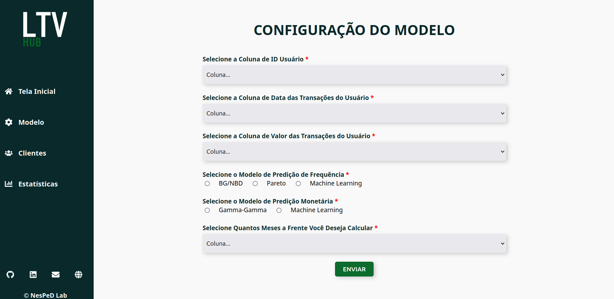

# LTV-HUB


### 💡 Ferramenta de Cálculo de LTV (CLV)

O **LTV-HUB** foi desenvolvido para simplificar os cálculos do Lifetime Value (LTV) utilizando diversas abordagens avançadas e modelos configuráveis. Essa ferramenta é intuitiva e poderosa, permitindo que os usuários obtenham insights financeiros precisos de maneira prática.

---

## 🛠️ Funcionalidades

- **Configuração de Modelos**:
  - Seleção da coluna de ID do usuário.
  - Seleção da coluna de datas das transações.
  - Seleção da coluna de valores das transações.
  
- **Modelos de Predição de Frequência**:
  - BG/NBD
  - Pareto
  - Machine Learning

- **Modelos de Predição Monetária**:
  - Gamma-Gamma
  - Machine Learning

- **Previsão de LTV**:
  - Escolha do horizonte temporal em meses.



---

## 📋 Sobre o Projeto

**Desenvolvido por:** Maria Eduarda, estudante de Ciência da Computação na Universidade Federal de Viçosa (UFV).

- [GitHub](https://github.com/Duds04)
- [LinkedIn](https://www.linkedin.com/in/maria-eduarda-de-pinho-braga-558057219/)

**Laboratório:** NESPeD-LAB (Laboratório de Inteligência em Sistemas Pervasivos e Distribuídos).

---

## 🔧 Tecnologias Utilizadas

- **React.js** (Principal)
- **Python** (Principal)
- JSX
- HTML
- CSS

---

## 🖥️ Como Executar o Projeto

### Pré-requisitos

Certifique-se de ter instalado:
- **Node.js** (versão 18 ou superior).
- **NPM** ou **Yarn**.
- **Python** (versão 3.8 ou superior).

### Passo a Passo

1. Clone este repositório:
   ```bash
   git clone https://github.com/Duds04/LTVHub-FrontDesign.git
   ```

2. Navegue até o diretório do projeto:
   ```bash
   cd LTVHub-FrontDesign
   ```

### 🔹 Executando o Backend

3. Em um terminal, entre na pasta `BackEnd`:
   ```bash
   cd BackEnd
   ```

4. Se for a primeira execução, instale as dependências executando:
   ```bash
   ./setup_env.sh
   ```

5. Ative o ambiente virtual:
   ```bash
   source ambiente_exec/bin/activate
   ```

6. Inicie o servidor backend:
   ```bash
   python main.py
   ```

### 🔹 Executando o Frontend

7. Em outro terminal, entre na pasta `FrontEnd`:
   ```bash
   cd FrontEnd
   ```

8. Se for a primeira execução, instale as dependências:
   ```bash
   npm install
   ```

9. Inicie o servidor frontend:
   ```bash
   npm start
   ```

10. Acesse a aplicação no navegador em `http://localhost:3000`.

---

## 📜 Licença

© NESPeD-LAB. Todos os direitos reservados.

---

## 🛡️ Contribuições

Contribuições são bem-vindas! Por favor, abra uma issue ou envie um pull request para melhorias.

### Como Contribuir

1. Faça um fork do repositório.
2. Crie uma branch para a sua feature:
   ```bash
   git checkout -b feature/nome-da-feature
   ```
3. Commit suas mudanças:
   ```bash
   git commit -m 'Adiciona nova feature'
   ```
4. Envie as alterações:
   ```bash
   git push origin feature/nome-da-feature
   ```
5. Abra um Pull Request.

---

<div align="center">
  <strong>🌟 Obrigado por usar o LTV-HUB! 🌟</strong>
</div>

